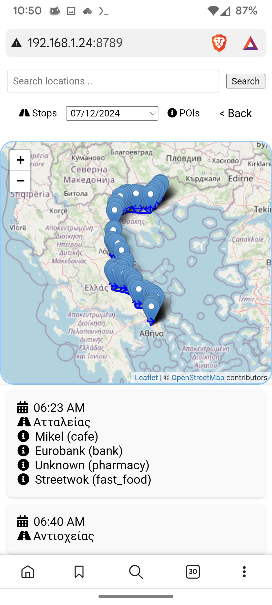
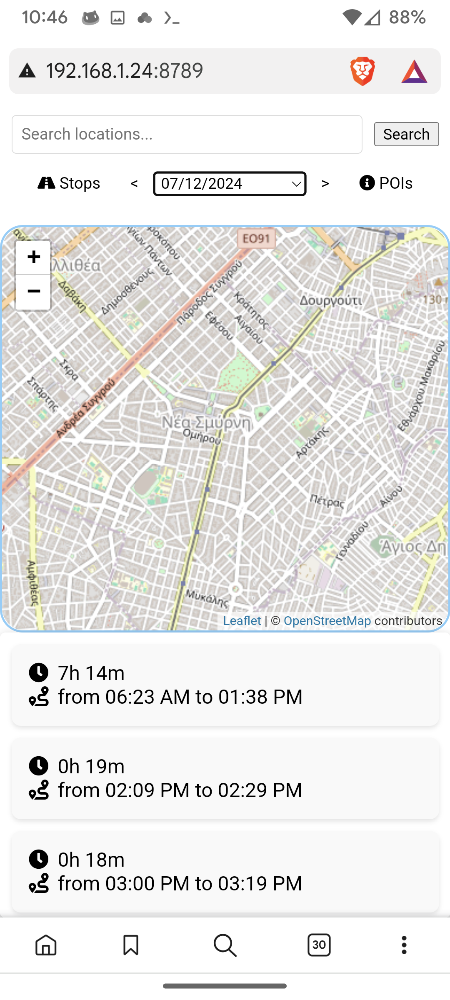
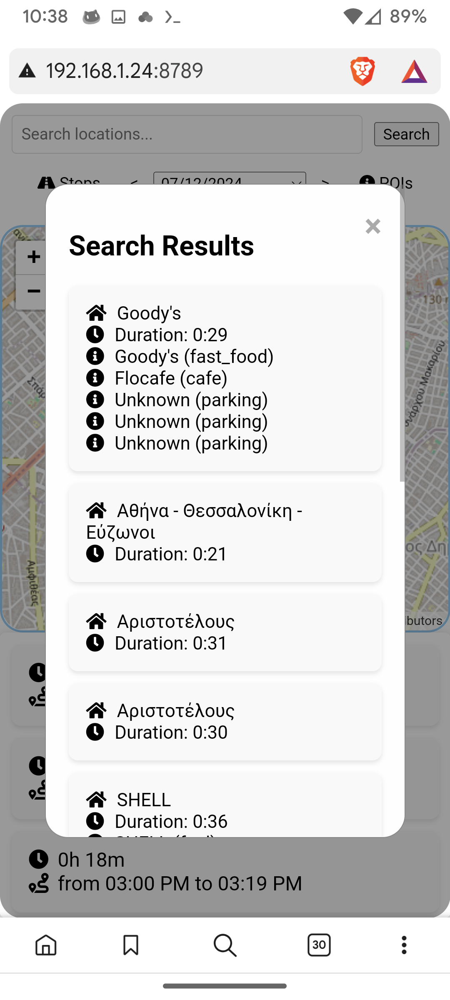
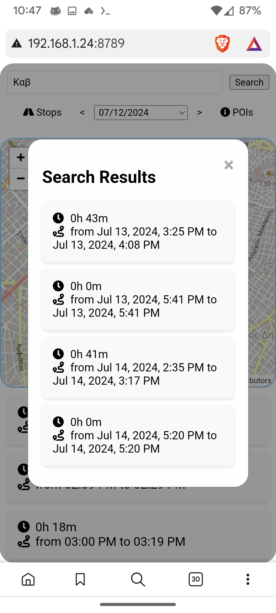
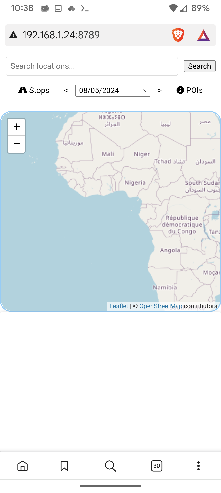
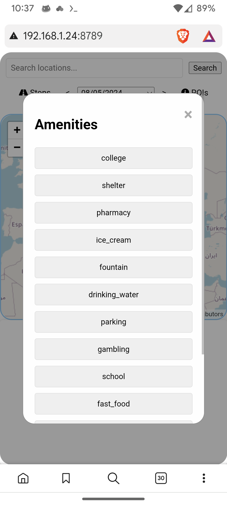

# **Location History**

"Location history" aims to be a location history visualizer that offers search (city, region, state, address,postal code but also amenities and amenity names aka POIs),a date picker,day navigation arrows, a button to diaplay stops for the selected date,a button to group amenities in clickable categories and shows their routes, route grouping for the selected date and a map to visualize routes and location pins..

Here is a breakdown of each aspect of the app if you want to read more:

Backend

## Backend

On the backend side , app.py Python code defines a Flask web application with several functionalities related to processing owntracks location data.

Here’s a breakdown:

- Takes a list of location records and computes stops where the time difference between consecutive locations exceeds 20 minutes. Returns a list of these stops along with their durations.
Group Locations by Route (groupLocationsByRoute):

- Groups locations into routes based on a 20-minute threshold between consecutive timestamps. Returns a list of routes.
Endpoints:

- /get_locations: Fetches location records from a JSON file filtered by a specified date.
  
- /search_locations: Searches for locations by a search term across all dates. Filters by POIs that are stops based on the term and return these routes.
  
- /get_all_pois_stops: Retrieves all POIs from locations that are identified as stops.
  
- /get_stops: Fetches stops and their durations based on a specific date.
Error Handling:

- Serves the index.html template at the root URL.

- Needs a processed_locations.json file in the same directory. The Flask app is configured to run on all network interfaces (0.0.0.0).

Preprocessing

## The prepropcess.py python script:

Process .rec files containing location data, reverse geocode the locations using the OpenStreetMap Nominatim service, and save the processed data to processed_locations JSON file.

Here’s a breakdown:

- Convert timestamps from greenwich times to local times.

- Reverse Geocode Function (reverse_geocode):

Inputs: Latitude (lat), Longitude (lon).
Output: Address as a string.
Functionality: Sends a GET request to the Nominatim reverse geocoding API to convert latitude and longitude into a human-readable address.

- Lookup Address Function (lookup_address):

Input: Address query (query).
Output: Address as a string.
Functionality: Sends a GET request to the Nominatim search API to find the address based on a search query.

- get_pois(lat, lon, radius=30):

Uses the Overpass API to fetch Points of Interest (POIs) around a specified latitude and longitude within a given radius.
Constructs a query to retrieve nodes, ways, and relations tagged as amenities, excluding benches.
Returns a list of POIs with their details.

###  Process Files Function:

- Processes all .rec files in the current directory, extracts location data, and performs reverse geocoding.

- Load Processed Files:
Checks and loads processed_files.txt to keep track of already processed files.

- Retrieve .rec Files:
Lists and sorts all .rec files in the current directory.

- Process Each .rec File:
For each file, unless it has been processed already (excluding the latest one), it reads and processes the data.
Each line is expected to have a timestamp, a type, and JSON data.
Parses the JSON data, extracts latitude, longitude, and timestamp.
Performs reverse geocoding to obtain the address.
Adds the timestamp in ISO format to the location data.

- Save Processed Files:
Updates processed_files.txt to mark files as processed.
Merge and Save Processed Locations:
Loads existing locations from processed_locations.json.
Merges new locations with existing ones, ensuring no duplicates based on tst (timestamp), lat, and lon.
Saves the updated locations back to processed_locations.json

Frontend

# Frontend

### index.html

- Controls Section: Contains a search input for locations, date navigation buttons, and a date picker.

- Map Container: Holds the map where routes and locations will be displayed.

- Timeline Section: Displays a timeline of routes.

- Search Results Popup: A modal popup to display search results

- The date selection fill the timeline container with routes.

- Location inclusion in a route made so that locations within a 30 min span belong to the same route.

- Timeline routes are expandable.Selecting a route entry in timeline displaying it as a directional polyline on the map.
Expanded route locations entries are name/time taged.

- Search resaults routes  are selectable. Clicking on them display the route on the map

- Search input also dominates the timeline . If it is filled only matched routes are displayed in the timeline .

- A dummy .rec file and the processed processed_locations.json that was generated from it with the preprocess.py script is added to this repo so that you can immediately view results if you want to test this app by simply running ` docker compose up --build` in the root Dir.

Owntracks

# Data gathering, Owntracks

### Owntracks:

- For location tracking i use owntracks.
It is a location tracking app.
It logs coordinates when the android device moves.Locations are saved in json files with a .rec extention.
What differs owntracks from other tracking apps is that it waits for the smart phone to tell it that the device has moves only then can OwnTracks react.
It then needs a server to connect to. Basic http server can be used . I have configured a more advanced set up , connecting to an mqtt broker using mutual TLS . For setting up the owntracks recorder (the server) read.

https://ippocratis.github.io/owntracks/ 

Remarks

- A copy_files.py is also added in this repo . You could fill the source and destination dir for .rec files and run it periodically in a cronjob.

- Running the docker compose file will first run the preprocess.py script , you can comment that line in entrypoint.sh if you don't want the script to run every time docker compose is starting.
  
- Handle reverse proxy and SSL certs in your webserver if you plan to expose the app outside your localhost. Mutual tls is a good practice too.

- Set your local time zone in preprocess.py
LOCAL_TZ = pytz.timezone('Europe/Athens')
Get proper locales for pytz from w.g. [here](https://gist.github.com/heyalexej/8bf688fd67d7199be4a1682b3eec7568)

- Threshold for stops and routes is 20 min . You can adjust it in their functions in the threshold_minutes variable in app.py

Run the app

- Put preprocess.py app.py requirements.txt the .rec files on root Dir and index.html in templates/index.html then run "python app.py" and open index.html

Or

- Put Dockerfile docker-compose.yml entrypoint.sh together with preprocess.py app.py requirements.txt and the .rec files on root Dir and index.html in templates/index.html and run "docker compose up --build -d" app is running on localhost on port 8789 but you can refine your port in docker-compose.

Or 

- Simply clone this repo , put your .rec files in the root dir and run "docker compose up --build -d"

| expanded | routes |
|--------|--------|
 |  |
| stops | search |
|  |  |
| home | POIs |
|  |  |
